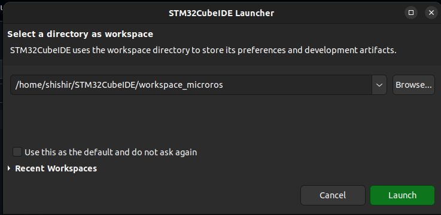

# Microros Setup
This repository is for microros installation on STM32 Boards(F411/F446RE)
>**Note:** If you have already completed microros installation once then skip step 1. For official documentation click on the below link
[Microros Documentation](https://micro.ros.org/docs/tutorials/core/first_application_linux/)

# Step 1:
Now open a new terminal/terminator and follow these steps
# Source the ROS 2 installation
	source /opt/ros/humble/setup.bash
	
# Create a workspace and download the micro-ROS tools
	mkdir microros_ws
	cd microros_ws
	
>**Warning:** Make sure you are in the microros_ws directory until it is mentioned to change the directory

	
# Clone the repository and update dependencies using rosdep
	git clone -b humble https://github.com/micro-ROS/micro_ros_setup.git src/micro_ros_setup
	sudo apt update && rosdep update
	rosdep install --from-paths src --ignore-src -y
	
# Install pip
	sudo apt-get install python3-pip

# Build micro-ROS tools and source them
	colcon build
	source install/local_setup.bash
	
# Create firmware step
	ros2 run micro_ros_setup create_firmware_ws.sh host

# Download micro-ROS-Agent packages
	ros2 run micro_ros_setup create_agent_ws.sh

# Build step
	ros2 run micro_ros_setup build_agent.sh
	source install/local_setup.bash
 >**Note:** Ignore the build warnings

# Step 2: 
Open a new STM32CubeIDE workspace via typing or using browse feature

Click Launch
>**Important:** Make sure you have logged into your STM32 Account and are connected to a personal Wi-fi
Click on File->New->STM32 Project
#If there are packages being installed then let them get installed properly/ Agree on if any license agreement
#You will see a target selector pop up 
Go to Board Selector and use the search bar and type NUCLEO-F446RE if you are using a nucleo board and STM32F411VET6 if you are using a discovery board
After selection click on next->Give an appropriate Project name (EX: microros)->Do not change any other option and click on next->Finish.
For initialize all peripherals with their default mode->Click Yes->DEvice config editor pop up -> Again click Yes.
An .ioc file would have been loaded where you can configure your STM32 Board Pins.
Click on Pinout drop down-> Select Clear Pinouts (or just use shortcut crtl+p)
For the warning that the Pinout configuration will be cleared Click Yes
This completes intial setup.

Step 4: Setting up the Pinout configuration
#Clock Configuration this defines the main clock(HSE) for the GPIO Pins/UART Pins and also for the LSE for the Watch dog Timer
#Advanced info(Skip this):You can change clock settings in the Clock Configurations option where there is an interface to select which clock is used as the main clock (HSE/HSI/PLL) and which mode(Crystal Ceramic Oscillator/RC Oscillator/LC Oscillator) and also frequency can be set using frequency divders and multipliers. 
Click on System Core ->RCC-> Select both High Speed External Clock (HSE) and Low Speed External Clock (LSE) as Crystal Ceramic Resonator this sets the main clock at 84MHz(For Nucleo board) and 100MHz(For DISCO Board).
Now again under System Core-> SYS-> Select Debug as Serial Wire,this is just settings for the debugging method(We Have Serial Wire /JTAG options but we are using STLINK Debugger which uses Serial Wire for the debugging purpose).
To establish UART Communication protocol required for Microros follow these steps:
Now Under Connectivity choose->USART2->Mode as Asynchronous->Under DMA(Direct Memory Access) Settings->Click on ADD->Select USART2_Rx under the drop down->Set Priority to Very High->Also make sure under DMA Request Settings change mode from normal to circular.This setting are for receiver. 
Similarly we are to set it up for transmitter,Under DMA(Direct Memory Access) Settings->Click on ADD->Select USART2_Tx under the drop down->Set Priority to Very High->Also make sure under DMA Request Settings set mode as normal.This is the DMA settings.
Now let us move to NVIC(Nested Vector Interrupt Control) Table settings
Go to NVIC Settings->Enable the USART2 golbal interrupt.

Step 5: Configuring FreeRTOS settings

 

